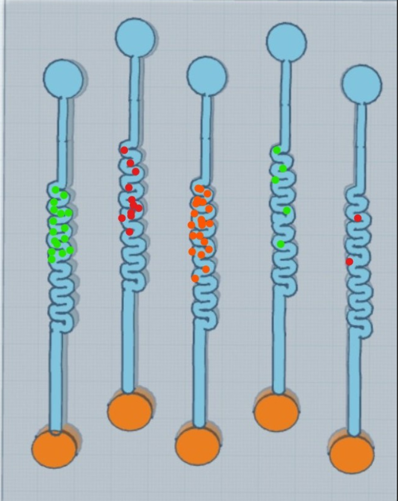

# Ova-sense

Ova-sense is a simulated chip-based cancer detection model designed to identify biomarkers from medical images using a Convolutional Neural Network (CNN).

## **Model Overview**
- **Input:** Medical images divided into 5 vertical regions representing biomarker activity.  
- **Architecture:** CNN with specialized convolutional layers and menopause-state encoding.  
- **Output:** Probability score for cancer presence.  

## **Setup**
Clone the repository:  
```bash
git clone https://github.com/SoumilB7/Ova-sense.git
```

## **Roles**
- Data prepraration : `dataprep.ipynb`
- Model training : `train.ipynb`
- Datasets : 
    - `dataset_pre` : Pre menopause biomarker levels chip readings
    - `dataset_post` : Post menopause biomarker levels chip readings

## **Visualization**
Use `visualization.ipynb` to visualize biomarker activity and CNN lifecycle.

##### **Peek into the chip**:
<p align="center">
  
  
</p>

## Model
- Stored at : [HuggingFace](https://huggingface.co/SoumilB7/Ova-sense)

## **License**
This project is licensed under the MIT License.
