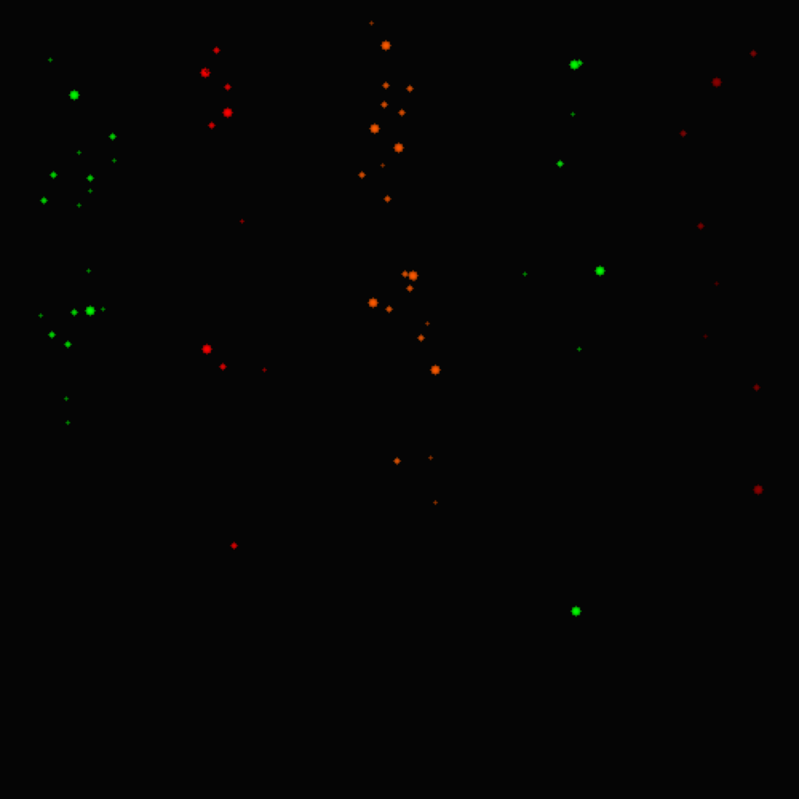
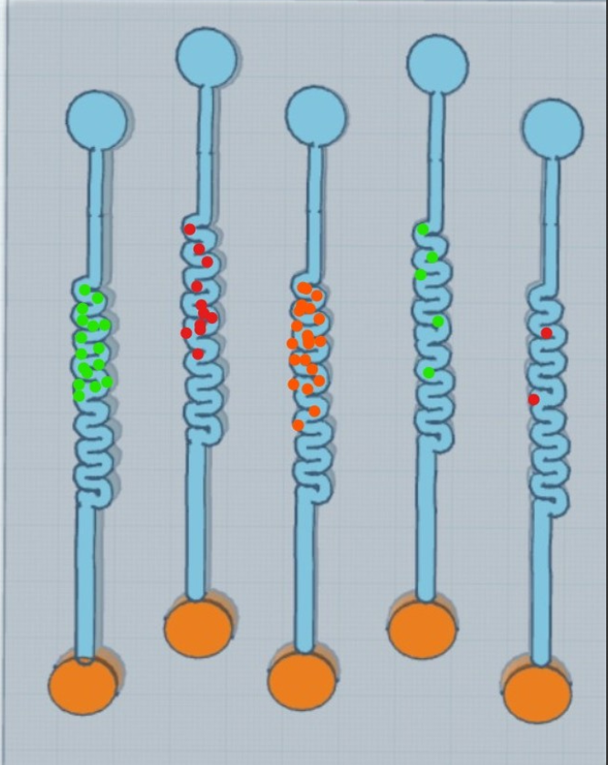
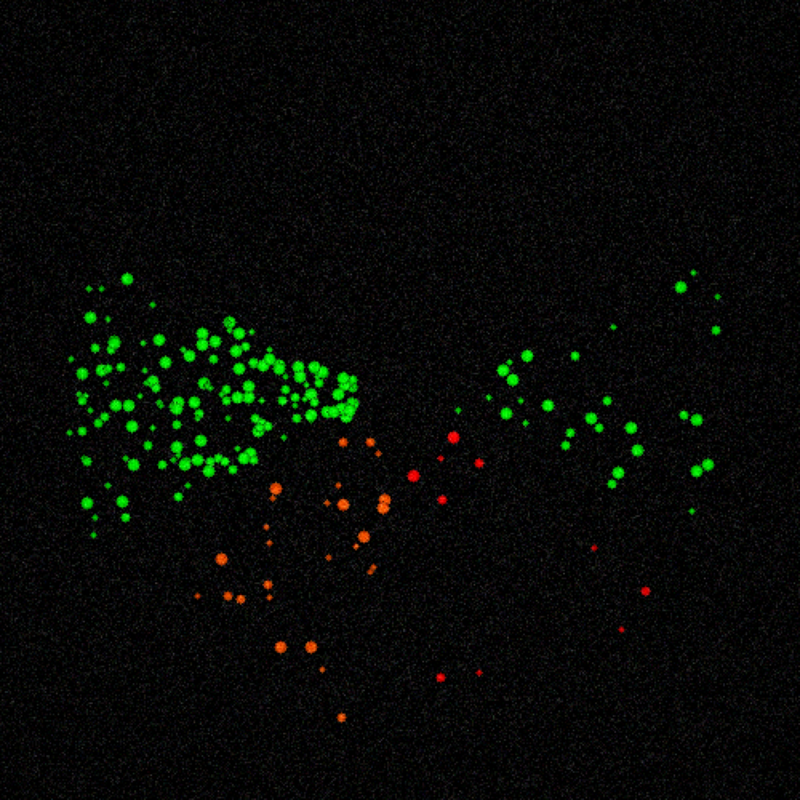
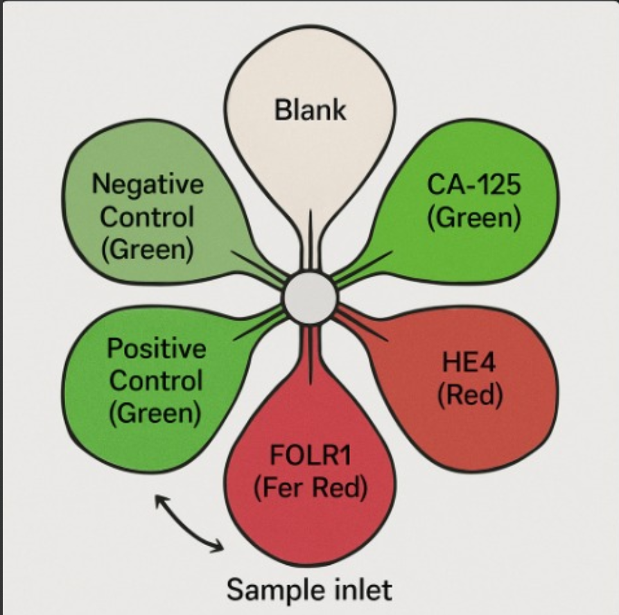

# Ova-sense

Ova-sense is a simulated chip-based cancer detection model designed to identify biomarkers from medical images using a Convolutional Neural Network (CNN).

## **Model Overview**
- **Input:** Medical images divided into 5 vertical regions representing biomarker activity.  
- **Architecture:** CNN with specialized convolutional layers and menopause-state encoding.  
- **Output:** Probability score for cancer presence.  

## **Setup**
Clone the repository:  
```bash
git clone https://github.com/SoumilB7/Ova-sense.git
```

## **Roles**
- Data prepraration : `dataprep_v2.ipynb`
- Model training : `train_v2git .ipynb`
- [Dataset](https://huggingface.co/datasets/SoumilB7/Ova-sense) : 
    - `pre` : Pre menopause biomarker levels chip reading
    - `post` : Post menopause biomarker levels chip reading

## **Visualization**
Use `visualization_v2.ipynb` to visualize biomarker activity and CNN lifecycle.

##### **Peek into the chip v1**:
<p align="center">
  
  
</p>

##### **Peek into the chip v2**:
<p align="center">
  
  
</p>


## Model
- `model_archives` has both pre and post models of V2
- additionally stored at : [HuggingFace](https://huggingface.co/SoumilB7/Ova-sense)

## **License**
This project is licensed under the terms written in the `LICENSE.txt` file.
